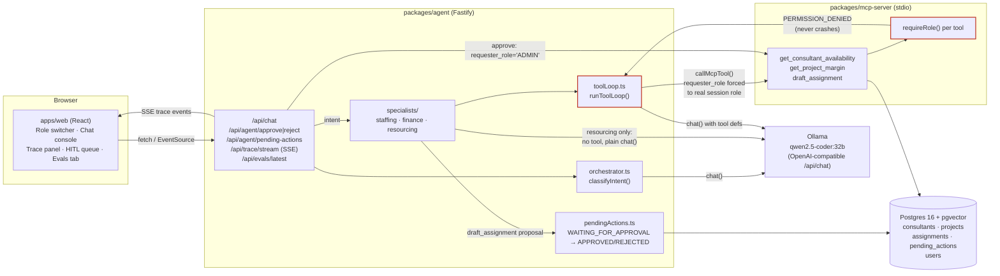
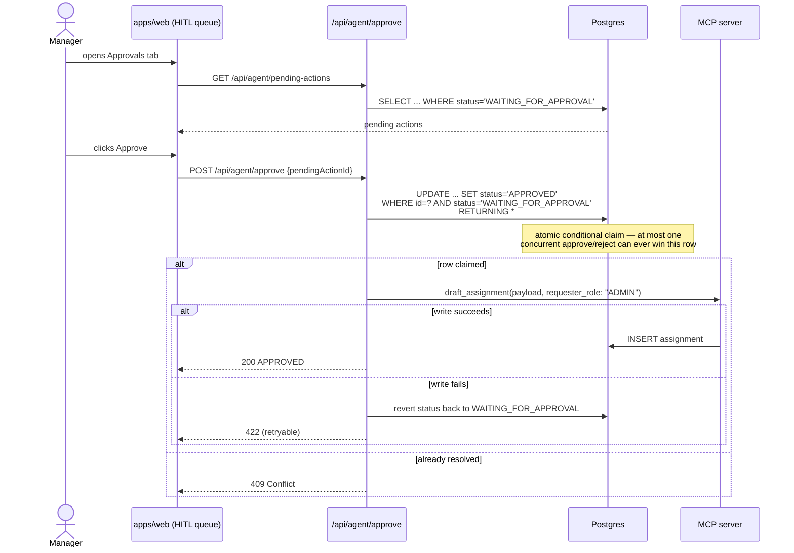

# SkillsMatch MCP

A permission-aware staffing agent platform. A local LLM (via [Ollama](https://ollama.com)) drives
role-scoped specialist agents that call tools on an [MCP](https://modelcontextprotocol.io) server
backed by Postgres + pgvector, with a human-in-the-loop approval gate for any write and a React
dashboard for observing and controlling all of it.

## System architecture



## Request flow: a single chat turn

Every `POST /api/chat` call goes through the same pipeline regardless of which specialist ends up
handling it. This is the "orchestration" layer — one classifier routing to one of three
independent, role-scoped agents.

```mermaid
sequenceDiagram
    actor User
    participant Web as apps/web
    participant API as /api/chat
    participant Orc as orchestrator.classifyIntent
    participant Spec as specialist (staffing/finance/resourcing)
    participant Loop as toolLoop.runToolLoop
    participant LLM as Ollama
    participant MCP as MCP server
    participant DB as Postgres

    User->>Web: types a message, picks a role
    Web->>API: POST {message, role}
    API->>Orc: classifyIntent(message)
    Orc->>LLM: chat() — classification prompt
    LLM-->>Orc: "staffing_match" | "margin_check" | "draft_assignment" | "general"
    Orc-->>API: Intent
    API-->>Web: SSE: classification event

    alt staffing_match / margin_check
        API->>Spec: run({message, role, runId, onTraceEvent})
        Spec->>Loop: runToolLoop({systemPrompt, tools, role})
        loop up to 5 steps, up to 5 total tool calls
            Loop->>LLM: chat(messages, tools)
            LLM-->>Loop: tool_calls[] or final content
            Loop-->>Web: SSE: tool_call trace event
            Note over Loop: requester_role is ALWAYS overwritten<br/>with the real session role here —<br/>a model-claimed role is discarded
            Loop->>MCP: callMcpTool(name, {...args, requester_role: role})
            MCP->>MCP: requireRole() check
            alt authorized
                MCP->>DB: query
                DB-->>MCP: rows
                MCP-->>Loop: result
            else not authorized
                MCP-->>Loop: PERMISSION_DENIED
                Loop-->>Web: SSE: permission_denied event
                Note over Loop: loop stops immediately, no retry
            end
            Loop-->>Web: SSE: tool_result trace event
        end
        Loop-->>Spec: {finalAnswer, trace}
    else draft_assignment
        API->>Spec: resourcing.run({message, role})
        alt role not ADMIN/RESOURCING_MANAGER
            Spec-->>API: permission_denied (no LLM/tool call at all)
        else
            Spec->>LLM: chat() — no tools, asks for {project_id, consultant_id, hours} JSON
            LLM-->>Spec: proposal JSON or clarifying question
            Spec->>DB: createPendingAction("draft_assignment", proposal)
            Note over DB: status = WAITING_FOR_APPROVAL
            Spec-->>API: "submitted, awaiting approval"
        end
    else general
        API->>LLM: chat() with a guard prompt<br/>("never state facts you didn't look up")
        LLM-->>API: finalAnswer
    end

    API-->>Web: {finalAnswer, trace}
    Web-->>User: renders reply + live trace panel
```

## Human-in-the-loop approval

`draft_assignment` is never executed directly by a specialist — it can only be written by the
approve route, and only from a `WAITING_FOR_APPROVAL` row.



## Repo layout

| Path | What it is |
|---|---|
| `db/` | Postgres 16 + pgvector schema, seed data, consultant-embedding generation |
| `packages/shared/` | Shared `Role` enum, MCP tool Zod schemas, DB pool helper |
| `packages/mcp-server/` | MCP server: `get_consultant_availability`, `get_project_margin`, `draft_assignment`, each RBAC-gated via `requireRole()` |
| `packages/agent/` | Fastify HTTP+SSE service: intent classifier, tool loop, three specialists, HITL approve/reject, trace streaming |
| `evals/` | Offline scenario runner scoring the live `/api/chat` API on tool-selection accuracy, grounding, and permission-boundary compliance |
| `apps/web/` | React dashboard: role switcher, chat console, live execution trace panel, HITL approval queue, eval metrics tab |

## Multi-agent orchestration, in short

- **One classifier, three specialists.** `classifyIntent()` is the only router — it never calls a
  tool itself, it just labels the message and hands off. Each specialist (`staffing`, `finance`,
  `resourcing`) is independently scoped to exactly one MCP tool (or, for `resourcing`, no tool at
  all — it only ever produces a proposal for a human to approve).
- **The trust boundary lives in one place.** `runToolLoop()` is shared by `staffing` and `finance`;
  every `callMcpTool()` call inside it unconditionally overwrites `requester_role` with the real,
  session-derived role right before the request leaves the process — a model that claims a
  different role in its tool-call arguments is always ignored.
- **Permission denials short-circuit, never crash.** The MCP server returns a structured
  `PERMISSION_DENIED` result; the tool loop treats that as a terminal state, not something to
  retry or paper over.
- **Mutations always wait for a human.** `draft_assignment` is only ever invoked from the approve
  route, gated by an atomic, race-safe status transition in Postgres.
- **Every step is observable live.** Each trace event (`classification`, `model_thought`,
  `tool_call`, `tool_result`, `permission_denied`) is streamed over SSE the moment it's produced,
  tagged with a `runId` correlating the whole turn — the dashboard's trace panel and the eval
  suite both consume this same stream.
