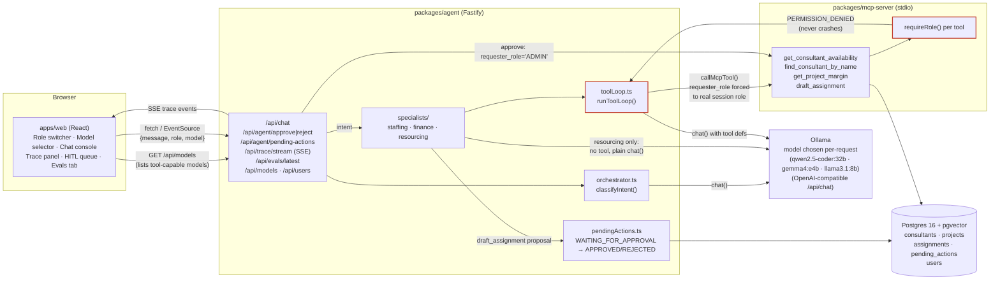
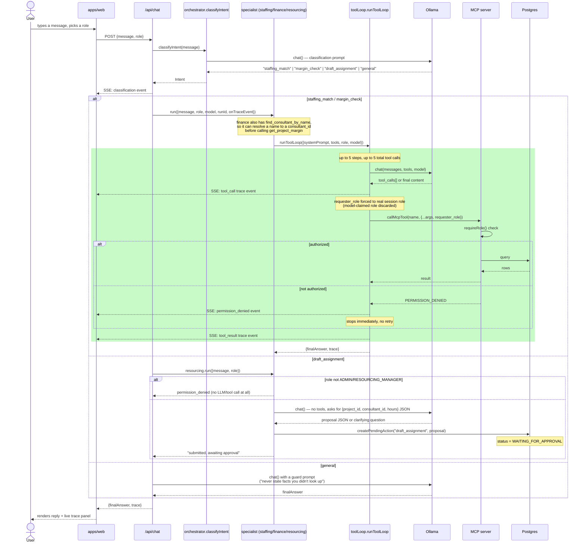
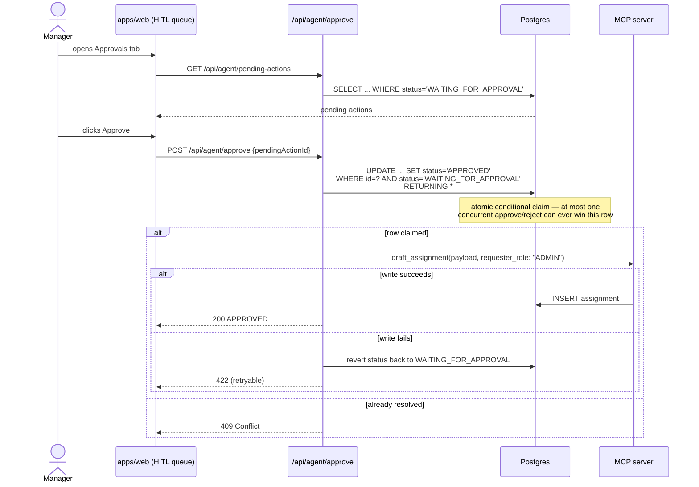

# SkillsMatch MCP

A permission-aware staffing agent platform. A local LLM (via [Ollama](https://ollama.com)) drives
role-scoped specialist agents that call tools on an [MCP](https://modelcontextprotocol.io) server
backed by Postgres + pgvector, with a human-in-the-loop approval gate for any write and a React
dashboard for observing and controlling all of it.

## System architecture

## Request flow: a single chat turn

Every `POST /api/chat` call goes through the same pipeline regardless of which specialist ends up
handling it. This is the "orchestration" layer — one classifier routing to one of three
independent, role-scoped agents.

## Human-in-the-loop approval

`draft_assignment` is never executed directly by a specialist — it can only be written by the
approve route, and only from a `WAITING_FOR_APPROVAL` row.

## Repo layout

| Path | What it is |
|---|---|
| `db/` | Postgres 16 + pgvector schema, seed data, consultant-embedding generation |
| `packages/shared/` | Shared `Role` enum, MCP tool Zod schemas, DB pool helper |
| `packages/mcp-server/` | MCP server: `get_consultant_availability`, `find_consultant_by_name`, `get_project_margin`, `draft_assignment`, each RBAC-gated via `requireRole()` (`find_consultant_by_name` is open to all roles — it discloses nothing `get_consultant_availability` doesn't already) |
| `packages/agent/` | Fastify HTTP+SSE service: intent classifier, tool loop, three specialists, HITL approve/reject, trace streaming |
| `evals/` | Offline scenario runner scoring the live `/api/chat` API on tool-selection accuracy, grounding, and permission-boundary compliance |
| `apps/web/` | React dashboard: role switcher, chat console, live execution trace panel, HITL approval queue, eval metrics tab |

## Model selection

The dashboard's model selector (`GET /api/models`, backed by Ollama's `/api/tags`) lists every
locally-pulled model that reports `tools` in its capabilities, and threads the chosen `model` name
through `/api/chat` into the classifier, every specialist, and the tool loop's `chat()` calls — so
a single request is free to use a different model than the last one. In this environment,
`qwen2.5-coder:32b` is flagged red in the picker: it reliably hangs Ollama's single-request queue
on this machine. `gemma4:e4b` and `llama3.1:8b` are smaller and respond, though a small model may
still narrate a tool call as prose instead of issuing it, or stop after one call in a
multi-tool-call chain (e.g. resolving a name, then never following up with the margin lookup) —
model capability, not something the orchestration layer can paper over.

## Multi-agent orchestration, in short

- **One classifier, three specialists.** `classifyIntent()` is the only router — it never calls a
  tool itself, it just labels the message and hands off. Each specialist (`staffing`, `finance`,
  `resourcing`) is independently scoped to exactly one MCP tool (or, for `resourcing`, no tool at
  all — it only ever produces a proposal for a human to approve).
- **The trust boundary lives in one place.** `runToolLoop()` is shared by `staffing` and `finance`;
  every `callMcpTool()` call inside it unconditionally overwrites `requester_role` with the real,
  session-derived role right before the request leaves the process — a model that claims a
  different role in its tool-call arguments is always ignored.
- **Permission denials short-circuit, never crash.** The MCP server returns a structured
  `PERMISSION_DENIED` result; the tool loop treats that as a terminal state, not something to
  retry or paper over.
- **Mutations always wait for a human.** `draft_assignment` is only ever invoked from the approve
  route, gated by an atomic, race-safe status transition in Postgres.
- **Every step is observable live.** Each trace event (`classification`, `model_thought`,
  `tool_call`, `tool_result`, `permission_denied`) is streamed over SSE the moment it's produced,
  tagged with a `runId` correlating the whole turn — the dashboard's trace panel and the eval
  suite both consume this same stream.
